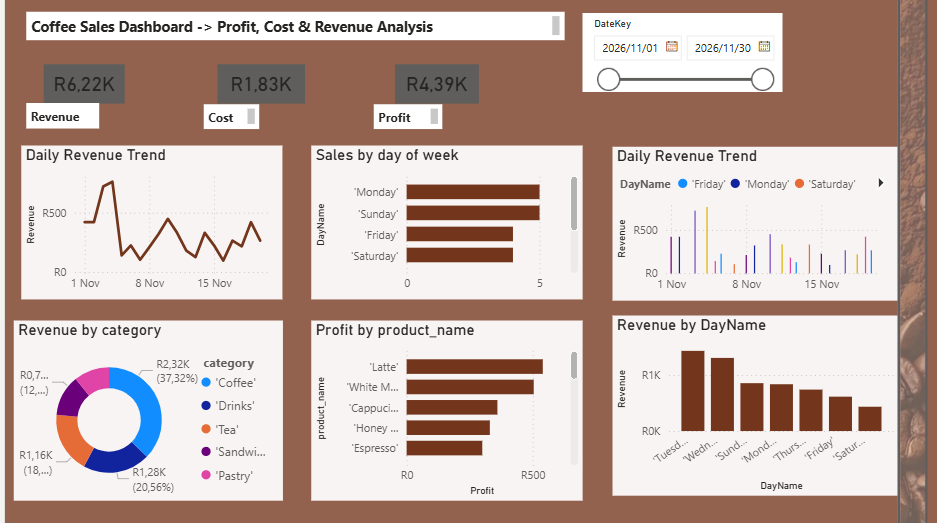

# Coffee-sales-dashboard

## Overview

Coffee sales database and Power BI dashboard project developed for sales analysis and data visualization.

The database was designed and created from scratch using MySQL Workbench. The data was then prepared for CSV file export and intergrated to Power BI to create dashboard visualization and business insights.

## Features

- Database tables created from scratch
- Sales, revenue, cost and profit analysis 
- Interactive Power BI dashboard
- Data modeling with tables relationship
- KPI reporting and visualization
  
## Tools Used

- SQL
- MySQL workbench
- Power BI
- DAX measure 

## Database tables:

- coffeememu table
- fact_sales table
- calendar table
- holidays table

  ## Dashboard insights

  - Daily revenue trend analysis
  - Revenue by product category
  - Profit by product
  - Sales by day of the week
  - Revenue performance by weekday.
 
    ## Skills demonstrated

    - Database design
    - SQL development
    - Data modeling
    - Data visualization
    - Dashboard development
    - DAX measure
    - Business intelligence Report

## Future Improvements 

- Enhance report capabilities 
- Advanced dashboard features 
- Expanded KPI tracking

  ## How to view the dashboard:

  - Import the SQL database files into MySQL Workbench
  - Export the tables as CSV files
  - Open the Power BI dashboard file (.pbix)
  - Refresh the data connections if required.
 
  
    ## Screenshot

